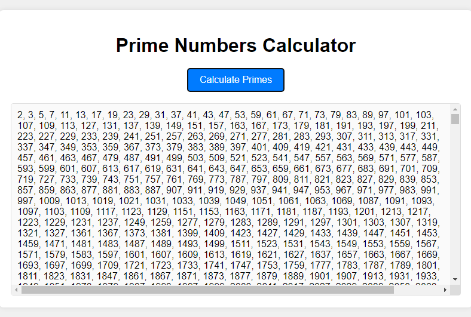

"# Calculate-Primes"

This application uses the Sieve of Eratosthenes algorithm, which is an efficient way to find all prime numbers up to a specified integer. The primes are calculated and displayed in the result area when the button is clicked.

